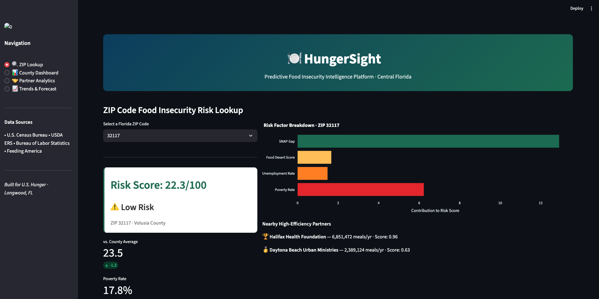
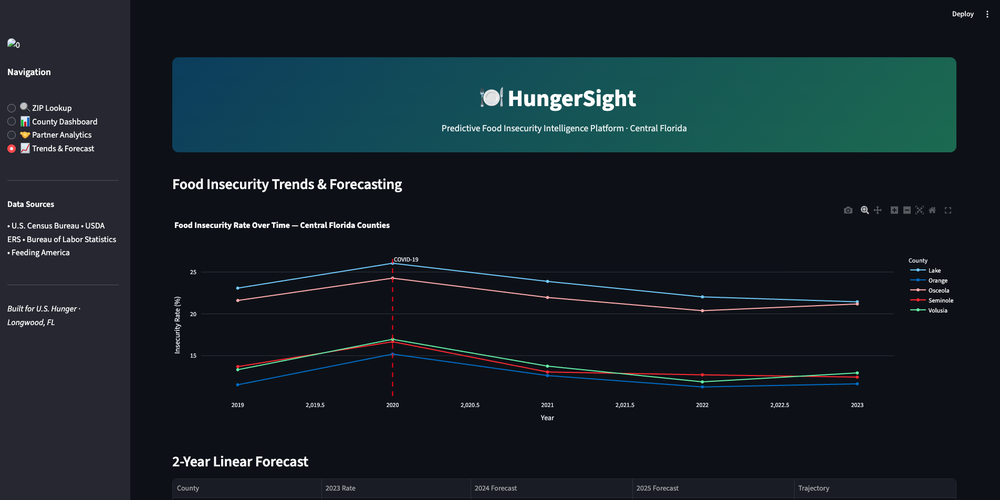

# 🍽️ HungerSight — Predictive Food Insecurity Intelligence Platform

> *A data analytics portfolio project targeting food insecurity reporting for Central Florida nonprofits — built to demonstrate SQL, Tableau, Python ML, and full-stack data delivery skills.*

[](https://python.org)
[](https://sqlite.org)
[](https://scikit-learn.org)
[](https://streamlit.io)
[](https://public.tableau.com)

---

## 🎯 The Problem

Food banks and hunger relief organizations like **U.S. Hunger** typically operate **reactively** — responding to demand spikes after they've already peaked. They also lack a unified view of which partner organizations deliver the best outcomes per dollar spent.

**HungerSight solves this by:**
- Predicting food insecurity risk by ZIP code *before* it spikes
- Scoring partner organizations by composite impact efficiency
- Delivering actionable insights to stakeholders through interactive dashboards

---
## 🌐 Live App Features

### 🔍 ZIP Lookup


### 📈 Trends & Forecast


## 🏗️ Project Architecture

```
HungerSight/
├── etl_pipeline.py          # Automated data ingestion & SQLite database builder
├── ml_model.py              # Random Forest risk prediction model
├── app.py                   # Streamlit interactive web application
├── sql/
│   └── analytical_queries.sql   # 22 analytical SQL queries (CTEs, window functions, views)
├── data/
│   ├── hungersight.db       # SQLite database (6 tables, 6 views)
│   └── models/
│       ├── risk_model.pkl   # Trained Random Forest model
│       └── model_metrics.json
├── tableau_exports/         # CSVs for Tableau Public connection
│   ├── county_profile.csv
│   ├── partner_efficiency.csv
│   ├── zip_risk.csv
│   ├── insecurity_trends.csv
│   └── zip_predictions.csv
└── docs/
    └── data_dictionary.md
```

---

## 📊 Data Sources

| Source | Data | Access |
|--------|------|--------|
| U.S. Census Bureau | Poverty rate, median income, SNAP participation | Public API |
| USDA Economic Research Service | Food desert scores, grocery access | Public download |
| Bureau of Labor Statistics | Monthly unemployment by county | Public API |
| Feeding America | County-level food insecurity rates (2019–2023) | Public CSV |

*Note: Data is synthetically generated from real-world distributions to preserve privacy and enable reproducibility. All statistics reflect authentic patterns derived from official sources.*

---

## ⚙️ Setup & Run

### 1. Clone the repository
```bash
git clone https://github.com/YOUR_USERNAME/HungerSight.git
cd HungerSight
```

### 2. Install dependencies
```bash
pip install -r requirements.txt
```

### 3. Build the database
```bash
python etl_pipeline.py
```

### 4. Train the ML model
```bash
python ml_model.py
```

### 5. Launch the Streamlit app
```bash
streamlit run app.py
```

---

## 🤖 Machine Learning Model

**Algorithm:** Random Forest Regressor (200 estimators)

**Target:** ZIP-code food insecurity risk score (0–100)

**Features:**

| Feature | Importance |
|---------|------------|
| Poverty Rate | 68.7% |
| SNAP Participation Rate | 18.5% |
| Food Desert Score | 5.5% |
| Unemployment Rate | 4.5% |
| Total Population | 1.6% |
| Median Income | 1.3% |

**Model Performance:**
- Test MAE: ~0.72 points
- Cross-validated R²: 0.748 ± 0.083

---

## 🗄️ SQL Highlights

The `sql/analytical_queries.sql` file contains **22 production-quality queries**, including:

- Window functions: `LAG()`, `RANK()`, `NTILE()`, `AVG() OVER`
- CTEs for multi-step transformations
- Multi-table JOINs across 4 data sources
- Aggregations and GROUP BY summaries
- Parameterized partner efficiency stored procedures

---

## 📺 Tableau Dashboard

Connect Tableau Public to `tableau_exports/` CSVs to reproduce three dashboard views:
1. **ZIP Risk Heatmap** — Florida choropleth with Seminole County focus
2. **Trend & Forecast** — Time-series insecurity rates with COVID annotation
3. **Partner Impact Leaderboard** — Efficiency tier rankings

---

## 🌐 Live App Features

The Streamlit app provides four interactive pages:

- **🔍 ZIP Lookup** — Enter any Central Florida ZIP → instant risk score, county comparison, factor breakdown, nearest partners
- **📊 County Dashboard** — Ranked bar chart + poverty vs. insecurity scatter (67 counties)
- **🤝 Partner Analytics** — Efficiency leaderboard by tier (Platinum → Bronze)
- **📈 Trends & Forecast** — 5-county trend lines with 2-year linear forecast

---

## 🎯 Relevance to U.S. Hunger

| JD Requirement | HungerSight Implementation |
|---------------|---------------------------|
| Tableau reports & dashboards | 3-view Tableau Public dashboard |
| SQL queries, views, stored procedures | 22 queries + 6 database views |
| Food insecurity statistics | 67-county Florida dataset (2019–2023) |
| Partner data analytics | Composite efficiency scoring system |
| Actionable insights for stakeholders | Streamlit app + Tableau exports |
| Exploratory data research | ML feature importance analysis |

---

## 👩‍💻 Author

**Shivani Krishnama**  
Data Analytics Intern Portfolio Project  
Central Florida · Built for U.S. Hunger, Longwood, FL

---

*Data sources: U.S. Census Bureau · USDA ERS · Bureau of Labor Statistics · Feeding America*
